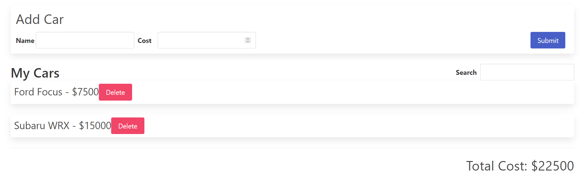
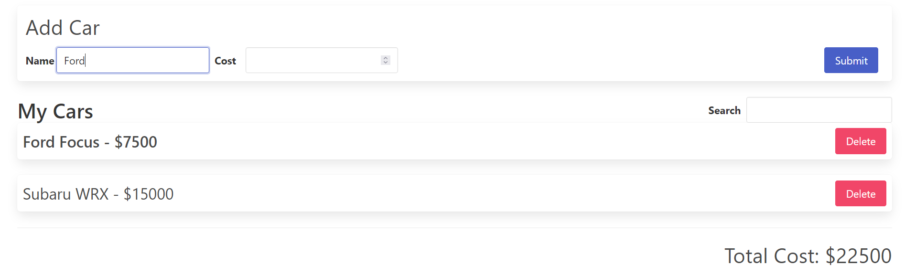
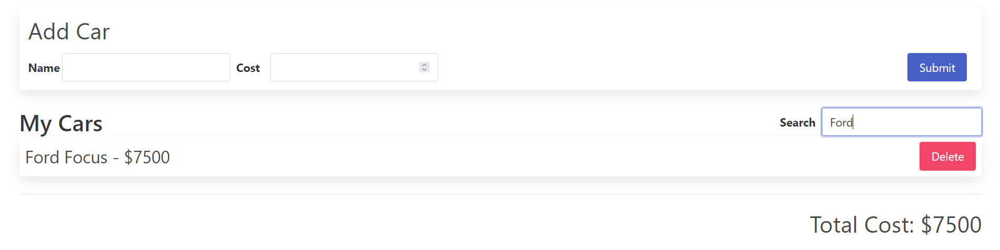

# Cars

## Description

This React-Redux app allows the user to track cars by adding, searching, and deleting them. A user can add a car name and its value to submit it to the list of cars displayed towards the buttom. Also, he can delete a car from the list of cars. A total value of cars is displayed in the buttom. Furthermore, a user can search for a car while other cars are temporarily hidden. Finally, if a similar car name is going to be added, current car in the list will be highlighted accordingly.

## Images

Here are examples of the app features:

Highlighting the car name and its value:

Searching for a car:

## Dependencies

This project uses the following dependency:

- Bulma framework to add style.

## Acknowledgments

This project is made possible by:

- [Stephen Grider](https://www.udemy.com/user/sgslo/) and his course [Modern React with Redux [2023 Update]](https://www.udemy.com/course/react-redux/).
